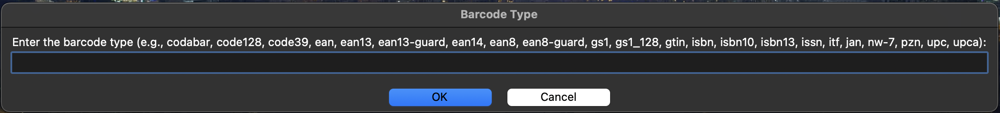
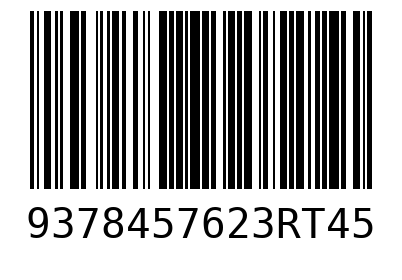

# Barcode Generator

This project is part of the Mini-Python-Projects-Collections repository. It contains a Python script that generates barcodes using a simple command-line interface.

## Project Structure
``` 
Mini-Python-Projects-Collections/ 
| 
|──barcode_generator/ 
    |──barcode_generator.py 
    |──readme.md 
    |──requirements.txt 
    |──.gitignore
```

- `barcode_generator.py`: The main Python script that generates barcodes.
- `readme.md`: This file, containing project information and usage instructions.
- `requirements.txt`: A file listing the project's dependencies.
- `.gitignore`: Specifies intentionally untracked files to ignore.

## Functionality

The `barcode_generator.py` script does the following:

1. Prompts the user to choose a barcode format from a list of available options.
2. Allows the user to input data for the barcode generation.
3. Generates the barcode image based on the input.
4. Saves the generated barcode image in the `barcode_images/` directory.

## Requirements

This project requires the `python-barcode` library along with `Pillow` for image handling. To install the requirements, use:

```pip install -r requirements.txt```

## Usage

1. Ensure you have Python installed on your system.
2. Navigate to the `barcode_generator` directory.
3. Install the required dependencies using the command mentioned in the Requirements section.
4. Run the script using the following command:

5. A popup window will appear, prompting you to choose a barcode format and input the data for barcode generation.
6. The generated barcode image will be saved in the `barcode_images/` directory.

## GUI Screenshots

### 1. Barcode Format Selection



### 2. Generated Barcode Image



## How it works

1. The script uses `tkinter` to create simple popup windows for user input.
2. The user selects a barcode format and inputs the corresponding data.
3. The barcode is generated and saved as an image in the `barcode_images/` directory.

## Customization

You can customize the barcode generation by modifying the following in `barcode_generator.py`:

- Modify the GUI prompts or add validation for specific barcode types.
- Adjust the default directory where images are saved.
- Extend the script to support additional barcode formats or input validation.

## Error Handling

The script includes basic error handling:

- It shows an error message if the user inputs an invalid barcode type.
- Unexpected errors are caught and displayed to the user in a popup window.

## Contributing

Contributions are welcome! Please feel free to submit a Pull Request.

## License

This project is open source and available under the [MIT License](../LICENSE).
