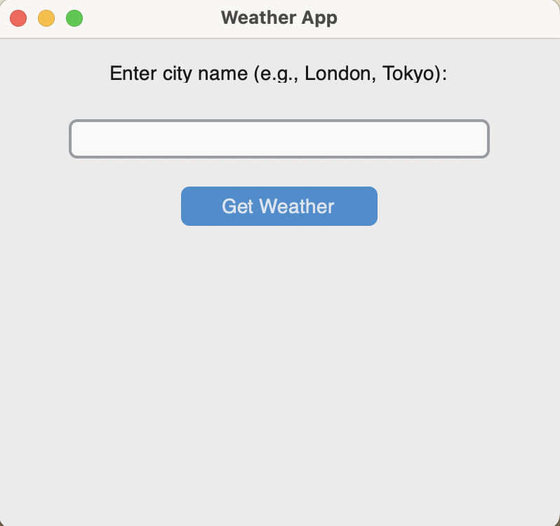
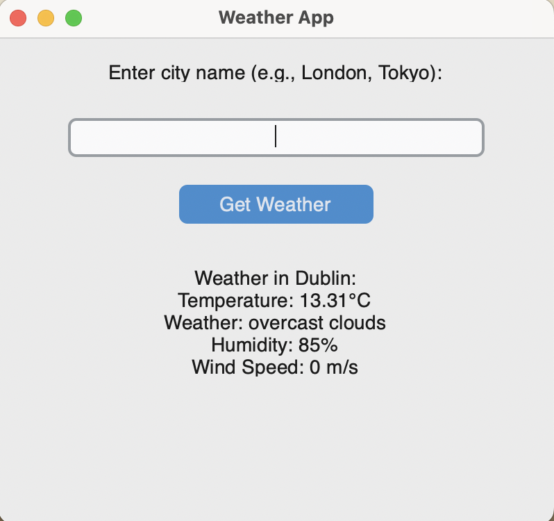

# Weather App

A simple and user-friendly weather application built with Python and `customtkinter` that fetches and displays the current weather conditions for any city using the OpenWeatherMap API.

## Introduction

This Weather App allows users to enter a city name and get the current weather information, including temperature, weather description, humidity, and wind speed. The application features a graphical user interface (GUI) for ease of use, and it provides clear, formatted weather data directly on the window.

## Features

- Fetches real-time weather data from the OpenWeatherMap API.
- Displays temperature, weather description, humidity, and wind speed.
- User-friendly GUI with input field and buttons.
- Error handling for invalid city names.
- Center-aligned input and results for better readability.

## Screenshot




## How to Use the App

1. **Clone the Repository**
   ```sh
   git clone https://github.com/your-username/Mini-Python-Projects-Collections.git
   cd Mini-Python-Projects-Collections/weatherApp

   
2. **Set Up the Environment**
- Install the required Python packages.
   ```sh
   pip install -r requirements.txt
   ```
3. **Run the App**

- Ensure you have your OpenWeatherMap API key.
- Replace `your_api_key_here` in `weather_api.py` with your actual API key.

   ```python
    API_KEY = 'your_api_key_here'
  ```
- Execute the main script to start the app.

   ```shell
   python main.py
   ```
4. **Using the App**
- Enter the city name (e.g., "London", "Tokyo") in the input field.
- Press the "Get Weather" button or hit the "Enter" key to fetch and display the weather data.

## How to Fork the Project
1. **Fork the Repository**
   - Click the "Fork" button at the top right corner of the repository page on GitHub. 

2. **Clone the Forked Repository**
   ```shell
    git clone https://github.com/your-username/Mini-Python-Projects-Collections.git
    cd Mini-Python-Projects-Collections/weatherApp
   ```

3. **Set Up the Environment and Make Changes**
- Install the required packages.
   ```shell
   pip install -r requirements.txt
   ```
  
- Make your changes to the codebase.
- Commit and push your changes to your forked repository.

## Contributing
Feel free to submit issues and enhancement requests. Pull requests are welcome! For major changes, please open an issue first to discuss what you would like to change.

## License
This project is licensed under the MIT License. See the [LICENSE](LICENSE) file for details.