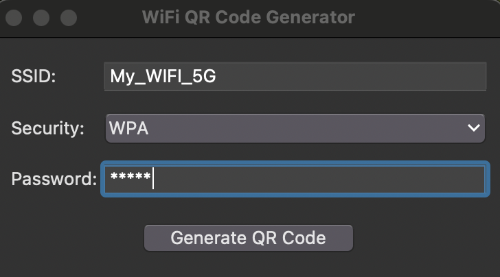

# WiFi QR Code Generator

This project is part of the Mini-Python-Projects-Collections repository. It contains a Python script that generates QR codes for WiFi networks using a simple graphical user interface.

## Project Structure

```
Mini-Python-Projects-Collections/
|
|──wifi_qrcode_generator/
    |──wifi_qrcode.py
    |──README.md
    |──requirements.txt
    |──.gitignore
    |──LICENSE
```

- `wifi_qrcode.py`: The main Python script that generates WiFi QR codes.
- `README.md`: This file, containing project information and usage instructions.
- `requirements.txt`: A file listing the project's dependencies.
- `.gitignore`: Specifies intentionally untracked files to ignore.
- `LICENSE`: The MIT license file for this project.

## Functionality

The `wifi_qrcode.py` script does the following:

1. Provides a graphical user interface for inputting WiFi network details.
2. Allows the user to input the SSID, security type, and password.
3. Generates a QR code image based on the input.
4. Saves the generated QR code image in the same directory as the script.

## Requirements

This project requires the `qrcode` library with PIL support for image handling. To install the requirements, use:

```
pip install -r requirements.txt
```

## Usage
1. Ensure you have Python installed on your system.
2. Clone this repository or download the project files.
3. Navigate to the wifi_qrcode_generator directory.
4. Install the required dependencies using the command mentioned in the Requirements section.
5. Run the script using the following command:
```
python wifi_qrcode.py
```
6. A graphical user interface will appear where you can:
 * Enter the WiFi SSID (network name).
 * Select the security type (WPA, WEP, or no password).
 * Enter the WiFi password (if required).
 * Click "Generate QR Code" to create the QR code.

7. The generated QR code will be saved in the same directory with the filename `{SSID}_wifi_qr.png`.

## GUI Screenshots
### 1. WiFi Network Input


### 2. Generated QR Code


## How it works

1. The script uses `tkinter` to create a simple graphical user interface for input.
2. The user enters the WiFi network details.
3. When the "Generate QR Code" button is clicked, the script creates a WiFi configuration string.
4. This string is then used to generate a QR code using the `qrcode` library.
5. The QR code is saved as an image file named after the SSID.

## Error Handling
The script includes basic error handling:

- If the SSID is empty, an error message will prompt the user to provide it.
- If the selected security type is WPA or WEP and the password field is left empty, an error message will be displayed.
- Unexpected errors during QR code generation are caught and displayed to the user.

## Customization
You can customize the WiFi QR Code Generator by modifying the following in wifi_qrcode.py:

* Add more options for security types or validations.
* Modify the default image settings like QR code size, color, etc.
* Change the directory where the images are saved.

## Contributing
Contributions are welcome! Please feel free to submit a Pull Request to improve this project.

## License
This project is open source and available under the MIT License.